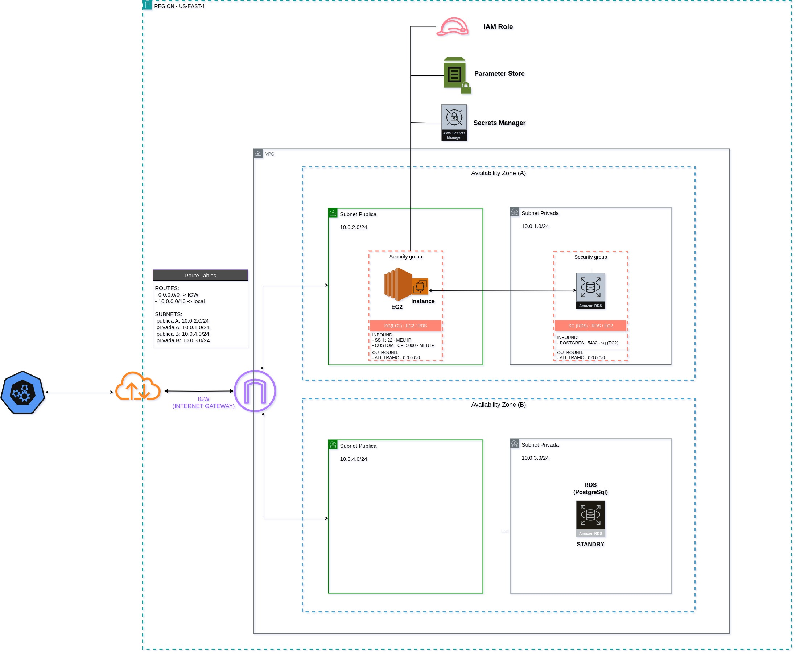

# Arquitetura



## 1. VPC 
Foi criada uma VPC
```
- Faixa de ip: 10.0.0.0/16
* tags: project / toggle
```

### 1.1 Subnets
Foram criadas quatro subnets e associado à [VPC](#1-vpc-) :
```
Subnets AZ-A
 - 10.0.1.0/24 (privada)
 - 10.0.2.0/24 (pública)
 
Subnets AZ-B
 - 10.0.3.0/24 (privada)
 - 10.0.4.0/24 (pública)
 
 * tags: project / toggle
```

### 1.2 IGW (Internet Gateway)
Foi criado um IGW e também associado à [VPC](#1-vpc-)

### 1.3 Route Tables (RTB)
Foi criada uma tabela de roteamento e as [subnets](#11-subnets) foram associadas
```
rotas: 
- 10.0.0.0/16 → local
- 0.0.0.0 → igw (Libera o acesso público ao gateway)

 * tags: project / toggle
```

## 2. Security

### 2.1 Roles
Como no Lab não é possível criar/atualizar as roles e policies, foi utilizada a role padrão do lab `LabRole`, que já contém policies para diversos serviços.

Fluxo básico da role no projeto:
```
EC2 (com IAM Role) → boto3 → SSM Parameter Store → retorna parâmetros           
EC2 (com IAM Role) → boto3 → Secrets Manager → retorna usuário/senha do banco

** Por tratar-se de um MVP, inicialmente os dados retornados foram colocado no cache da aplicação.
```

### 2.2 Security Groups
Foram criados 3 Security Groups:

SG VPC (Default) - Criado automaticamente: 
```
- INBOUND
- OUTBOUND
```

SG EC2 (Associado à instância EC2):
```
- INBOUND
    - SSH (TCP): 22 → Meu IP
    - Custom (TCP): 5000 → Meu IP
- OUTBOUND:
    - All Trafic: ALL → 0.0.0.0/0
```

SG RDS (Associado ao DB):
```
- INBOUND
    - PostgreSQL (TCP): 5432 → SG EC2
- OUTBOUND:
    - All Trafic: ALL → 0.0.0.0/0
```

## 3. EC2 
Foi criado uma instância do ec2 com as seguintes caracteristicas:
```
- SO: Linux/Ubuntu 24.04
- identifier: toggle-master-ec2
- az: us-east-1a
- role: LabRole
- sg: SG EC2
- maquina: t2.micro
- storage: 8gb (SSD / GP3)
* tags: project / toggle
```

## 4. Database - RDS
Foi criado um DB no RDS do tipo PostgreSql com as seguintes caracteristicas:
```
- tipo: PostgreSql 13.22
- identifier: togglemaster
- az: us-east-1a
- sg: SG RDS 
- maquina: db.t4g.micro
- storage: 20gb (SSD / GP2)
- host: togglemaster.xxx.us-east-1.rds.amazonaws.com
- port: 5432
- db_name=postgres
* tags: project / toggle
```

## 5. Dados

### 5.1 Secrets Manager
Armazenado o usuário e segredo do banco
```
- Secrets Manager:
  - Secret Name: 'rds-db-xxx'
    - User : xxx
    - Senha: xxx
```

### 5.2 Parameter Store
Armazenados os parâmetros de acesso ao banco:
```
- Parameter Store:
  - db_host     - name: /togglemaster/DB_HOST      (togglemaster.xxx.us-east-1.rds.amazonaws.com)
  - db_name     - name: /togglemaster/DB_NAME      (postgres)
  - db_port     - name: /togglemaster/DB_PORT      (5432)
  - secret_name - name: /togglemaster/SECRET_NAME  (rds-db-xxx)
```

