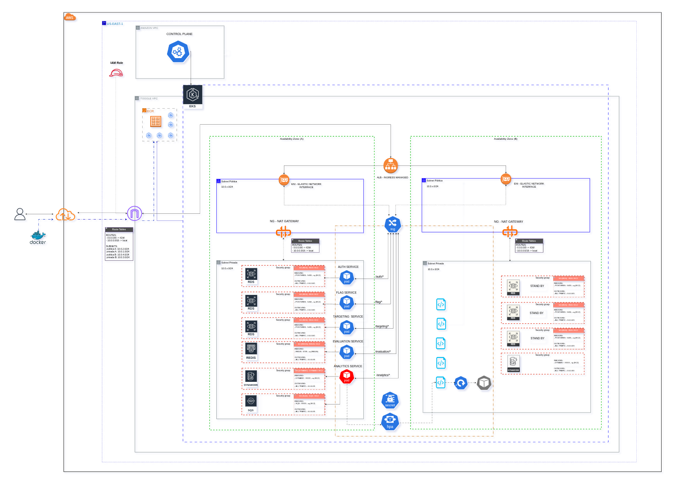

# Arquitetura



## 1. Arquitetura de Serviços

## Estrutura de dependências

* auth-service
* flag-service: depende de `auth-service`
* targeting-service: depende de `auth-service`
* evaluation-service: depende de `auth-service, flag-service e targeting-service`
* analytics-service: depende de `evaluation-service`


## 2. Arquitetura AWS

## 2.1. VPC

Foi criada uma VPC (toggle-vpc)

```
- Faixa de ip: 10.0.0.0/16
* tags-> project: toggle
```

### 2.1.1. Subnets

Foram criadas quatro subnets e associado à VPC

```
Subnets AZ-A
 - 10.0.1.0/24 (privada)
 - 10.0.3.0/24 (pública)
 
Subnets AZ-B
 - 10.0.2.0/24 (privada)
 - 10.0.4.0/24 (pública)
 
* tags subnets publicas:
- Name = toggle-public-a/b
- project = toggle
- kubernetes.io/cluster/toggle-cluster = shared
- kubernetes.io/role/elb = 1

* tags subnets privadas:
- Name = toggle-private-a/b
- project = toggle
- kubernetes.io/cluster/toggle-cluster = shared
- kubernetes.io/role/internal-elb = 1
```

### 2.1.2. IGW (Internet Gateway)

Foi criado um IGW e também associado à VPC

### 2.1.3. NG (Nat Gateway)

Foram criados um NG para cada subnet publica, para que os pods privados tenham acesso a internet, para instalações, updates, etc.

```
- toggle-ng-a (vinculado à subnet pública A 10.0.3.0/24)
- toggle-ng-b (vinculado à subnet pública B 10.0.4.0/24)
```

### 2.1.4. Route Tables (RTB)

Foram criadas tabelas de roteamento para disponibilizar acesso à internet para as [subnets](#11-subnets)

```
rota igw (Libera o acesso das subnets públicas à internet):
- 10.0.0.0/16 → local
- 0.0.0.0 → igw 

* tags-> project: toggle
```

```
rota privada (Libera o acesso da subnet privada-A à internet):
- 10.0.0.0/16 → local
- 0.0.0.0 → toggle-ng-a 

* tags-> project: toggle
```

```
rota privada ng-B (Libera o acesso da subnet privada-B à internet):
- 10.0.0.0/16 → local
- 0.0.0.0 → toggle-ng-b 

* tags-> project: toggle
```

### VPC mapa de recursos


## 2.2. Cluster 
Foi criado o cluster `toggle-cluster` para teste local usando o [KIND](../toggle-master-microservices/kind/kind-cluster.yaml) e na aws foi utilizado o EKS com a role (LabRole).

- Manifestos e Scripts [KIND](../toggle-master-microservices/kind/)
- Manifestos e Scripts [EKS](../toggle-master-microservices/eks/)

### 2.2.1. Node Group

Foi criado um Node Group `toggle-node-group` com a seguinte configuração:

```
AMI type:
 - Amazon Linux 2023 (x86_64) Standard 
 ** Considerando FinOps poderia ser atualizado para ARM64 (Devem ser atualizadas as Dockerfiles)

Instance types
 - t3.medium 
 ** Atualizar junto da alteração da arquitetura para ARM64

Nodes:
 - Desired size: 1
 - Minimum size: 1
 - Maximum size: 3 (Garante o 'mínimo' de escalabilidade. Acima disso validar a demanda com testes de carga e stress)

 Subnets:
 - private-a - 10.0.1.0/24 (privada)
 - private-b - 10.0.2.0/24 (privada)
```

### 2.2.2. NLB (Network Load Balancer)

Foi criado o NLB para fazer o balanceamento de carga do que iria para o EKS via Ingress

- xxx-yyy.elb.us-east-1.amazonaws.com


### 2.2.2. Ingress Nginx

Foi criado um Ingress para a exposição das rotas dos serviços 
- [EKS](../toggle-master-microservices/eks/ingress.yaml) 
- [KIND](../toggle-master-microservices/kind/ingress.yaml) 

### 2.3. ECR

Foram criados cinco repositórios com os seguintes nomes e as imagens foram enviadas:

```
- xxx.dkr.ecr.us-east-1.amazonaws.com/toggle-master/analytics-service
- xxx.dkr.ecr.us-east-1.amazonaws.com/toggle-master/auth-service
- xxx.dkr.ecr.us-east-1.amazonaws.com/toggle-master/evaluation-service
- xxx.dkr.ecr.us-east-1.amazonaws.com/toggle-master/flag-service
- xxx.dkr.ecr.us-east-1.amazonaws.com/toggle-master/targeting-service
```

### 2.4. Database - RDS

Foram criados 3 DB no RDS do tipo PostgreSql com as seguintes caracteristicas:

```
- tipo: PostgreSql 13.22
- az: us-east-1a
- sg: SG RDS 
- maquina: db.t4g.micro
- storage: 20gb (SSD / GP2)
- host: xxxx
- port: 5432
- db_name=postgres
* tags: project / toggle
```

- db-auth.xxx.us-east-1.rds.amazonaws.com
- db-flag.xxx.us-east-1.rds.amazonaws.com
- db-targeting.xxx.us-east-1.rds.amazonaws.com

### 2.5. SQS

Foi criada a queue `toggle-analytics-queue` no SQS

- AWS - sqs.us-east-1.amazonaws.com/xxx/toggle-analytics-queue
- LOCAL - Localstack [arquivo de init](../toggle-master-microservices/init-aws.sh)

### 2.6. DynamoDB

Foi criada a tabela `analytics_events` no DynamoDB na AWS

- LOCAL - Localstack [arquivo de init](../toggle-master-microservices/init-aws.sh)

### 2.7. Redis

Foi criado o cache `redis-evaluation` no Redis OSS 

- redis-evaluation-xxx.use1.cache.amazonaws.com:6379

## 3. Docker

### 3.1. Dockerfile para build das imagens

- [arquivo](../toggle-master-microservices/auth-service/Dockerfile) do auth-service
- [arquivo](../toggle-master-microservices/flag-service/Dockerfile) do flag-service
- [arquivo](../toggle-master-microservices/targeting-service/Dockerfile) do targeting-service
- [arquivo](../toggle-master-microservices/evaluation-service/Dockerfile) do evaluation-service
- [arquivo](../toggle-master-microservices/analytics-service/Dockerfile) do analytics-service

### 3.2. Docker Compose para testes locais

- [arquivo](../toggle-master-microservices/docker-compose.yaml) para execução do docker-compose


## 4. Collection (Insomnia)
- [arquivo](../doc/Insomnia_2025-11-20.yaml) para import collection


## 5. Alterações realizadas

### 5.1. Alterado /health para adição de probes no [app.py](../toggle-master-microservices/analytics-service/app.py) do analytics-service:

```python
# --- Probes ---
@app.route('/health/startup')
def health_startup():
    if not worker_started:
        return jsonify({"status": "not-started"}), 500

    return jsonify({"status": "started"}), 200

@app.route('/health/live')
def health_live():
    global last_heartbeat

    if time.time() - last_heartbeat > HEARTBEAT_INTERVAL:
        return jsonify({"status": "dead"}), 500

    return jsonify({"status": "alive"}), 200

@app.route('/health/ready')
def health_ready():
    global last_heartbeat

    if not worker_started:
        return jsonify({"status": "not-ready"}), 500
    if time.time() - last_heartbeat > HEARTBEAT_INTERVAL:
        return jsonify({"status": "not-ready"}), 500

    return jsonify({"status": "ready"}), 200
```

E no manifesto do analytics service [deployments](../toggle-master-microservices/eks/deployments/analytics.yaml)
```yaml
# Probes
startupProbe:
httpGet:
    path: /health/startup
    port: 8005
periodSeconds: 5
failureThreshold: 30

readinessProbe:
httpGet:
    path: /health/ready
    port: 8005
initialDelaySeconds: 5
periodSeconds: 10
failureThreshold: 3

livenessProbe:
httpGet:
    path: /health/live
    port: 8005
initialDelaySeconds: 15
periodSeconds: 10
failureThreshold: 3
```
