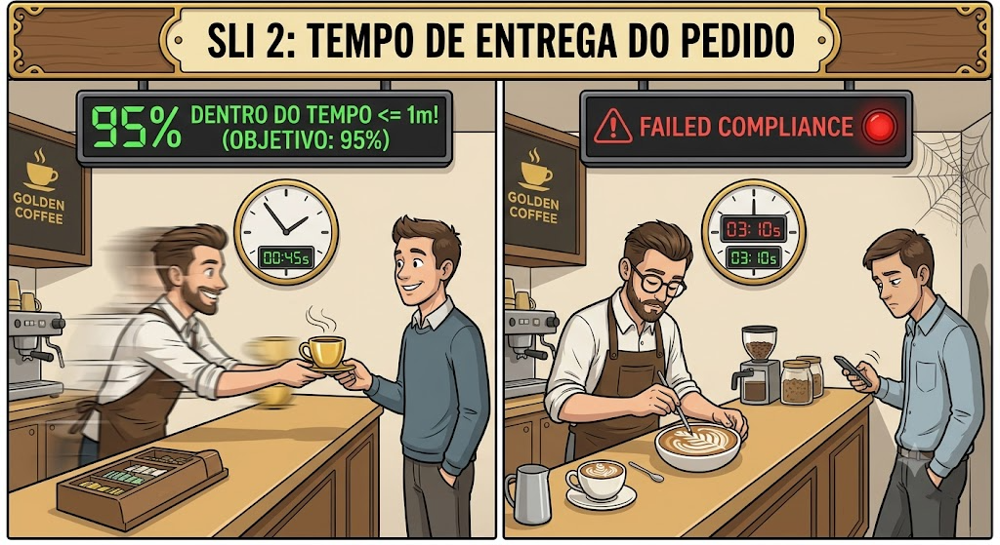
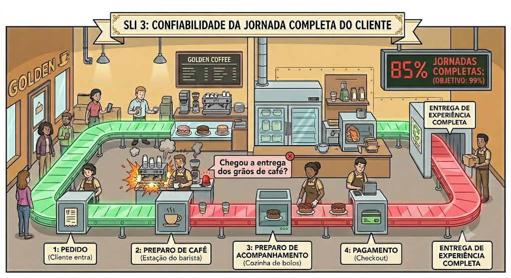
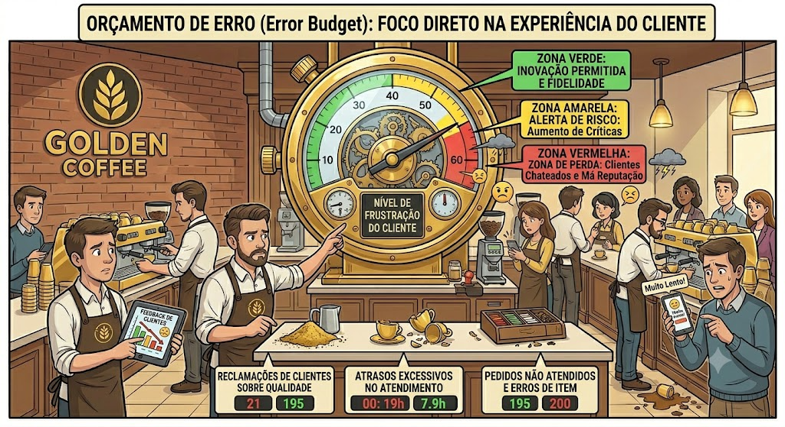

# Documentação de SRE, Observabilidade e Confiabilidade
## Solidary Tech

Esta documentação consolida os conceitos, implementações, justificativas técnicas e configurações de Engenharia de Confiabilidade (SRE) e Observabilidade adotados no ecossistema **Solidary Tech**, com foco principal no [`donation-service`](../solidary-tech/services/donation-service/) e sua integração com os serviços periféricos [`ngo-service`](../solidary-tech/services/ngo-service/) e [`volunteer-service`](../solidary-tech/services/volunteer-service/).

---

## 1. Engenharia de Confiabilidade: Definição de SLIs e SLOs

Para garantir a previsibilidade, estabilidade e a experiência de usuário no core business do ecossistema, foram estabelecidos Indicadores de Nível de Serviço (**SLIs**) e Objetivos de Nível de Serviço (**SLOs**) estritos. 
Para facilitar a compreensão teórica através de analogias operacionais, criamos (com uso de IA) uma série de imagens exemplificativas para cada SLI definido abaixo. Os Quatro Sinais de Ouro são:

  - Latência: O tempo que leva para processar uma requisição.

  - Tráfego: A medida da demanda colocada no sistema (ex: requisições por segundo).

  - Erros: A taxa de requisições que falham (explícita ou implicitamente).

  - Saturação: Quão "cheio" o sistema está, medindo a utilização dos recursos mais limitados.

  

**Justificativa Arquitetural (Google SRE Book & Workbook):**
Conforme estabelecido pelo Google no capítulo [*Monitoring Distributed Systems*](https://sre.google/sre-book/monitoring-distributed-systems/#xref_monitoring_golden-signals), monitorar um sistema complexo exige foco nos "Quatro Sinais de Ouro" (*The Four [Golden Signals](https://sre.google/sre-book/monitoring-distributed-systems/#xref_monitoring_golden-signals)*). Além das métricas clássicas de componentes isolados, a abordagem moderna de SRE exige o mapeamento de **Jornadas Críticas do Usuário (CUJs - Critical User Journeys)**, conforme detalhado no [*Site Reliability Workbook*](https://www.oreilly.com/library/view/the-site-reliability/9781492029496/). O sucesso do negócio não é medido por microsserviços individuais estarem operacionais, mas sim pela capacidade do usuário de completar um fluxo transacional end-to-end.

### SLI 1: Taxa de Sucesso de Requisições (Disponibilidade do Serviço)
**Definição Técnica:** A proporção de requisições HTTP válidas direcionadas ao `donation-service` que são processadas com sucesso, ou seja, que não resultam em erros de infraestrutura ou falhas internas do servidor (códigos HTTP `5xx`). Requisições com códigos `4xx` (como erros de validação de payload) são consideradas respostas corretas sob a ótica de negócios e não devem penalizar a métrica.

  

**Janela de Avaliação:** Janela móvel de 30 dias. 

  *(Nota Prática: Para fins de validação técnica neste Tech Challenge, o mecanismo matemático é atestado utilizando janelas reduzidas de observação — ex: últimas 1 a 4 horas — suprindo a ausência de um histórico operacional longo).*
**Objetivo de Nível de Serviço (SLO):** **99.9%** de sucesso.
**Expressão Matemática:**
  $$SLI = \frac{\text{Total de Requisições} - \text{Requisições 5xx}}{\text{Total de Requisições}} \times 100$$
Implementação em **PromQL**:
  ~~~promql
  sum(rate(http_requests_total{service="donation", status!~"5.."}[30d])) / sum(rate(http_requests_total{service="donation"}[30d])) * 100
  ~~~

### SLI 2: Latência de Resposta de Rotas Críticas (Performance do Serviço)
**Definição Técnica:** A proporção de requisições HTTP síncronas que completam seu ciclo de execução (Request-Response) dentro do limiar máximo tolerável para manter a fluidez da experiência do usuário, estabelecido em 250ms.

  

**Janela de Avaliação:** Janela móvel de 30 dias. 

  *(Nota Prática: Para fins de validação técnica neste Tech Challenge, o mecanismo matemático é atestado utilizando janelas reduzidas de observação — ex: últimas 1 a 4 horas — suprindo a ausência de um histórico operacional longo).*

**Objetivo de Nível de Serviço (SLO):** **95.0%** das requisições respondidas em tempo <= 250ms.
**Expressão Matemática:**
  $$SLI = \frac{\text{Requisições com Latência} \le 250\text{ms}}{\text{Total de Requisições}} \times 100$$

Implementação em **PromQL**:
  ~~~promql
  sum(rate(http_request_duration_seconds_bucket{service="donation", le="0.25"}[30d])) / sum(rate(http_request_duration_seconds_bucket{service="donation", le="+Inf"}[30d])) * 100
  ~~~

### SLI 3: Confiabilidade da Jornada de Doação (Fluxo de Negócio Composto)
**Definição Técnica:** A proporção de transações de doação iniciadas pelo usuário que completam com sucesso todo o fluxo de negócio distribuído. Este indicador realiza a composição do fluxo end-to-end, rastreando o ciclo completo através do APM (Traces). Ele é penalizado se **qualquer** dependência downstream falhar (seja uma quebra de autenticação, erro no processamento, ou falhas de persistência física).

  

**Janela de Avaliação:** Janela móvel de 30 dias.

  *(Nota Prática: Para fins de validação técnica neste Tech Challenge, o mecanismo matemático é atestado utilizando janelas reduzidas de observação — ex: últimas 1 a 4 horas — suprindo a ausência de um histórico operacional longo).*

**Objetivo de Nível de Serviço (SLO):** **99.0%** de jornadas completadas com sucesso.
**Expressão Matemática:**
  $$SLI = \frac{\text{Traces Raiz de Doação Bem-Sucedidos}}{\text{Total de Traces Raiz de Doação Iniciados}} \times 100$$
**Implementação no Datadog (APM Traces):** O indicador avalia diretamente o status do span raiz (`operation_name:http.request`, `resource_name:POST /api/v1/donations`), encapsulando a saúde de toda a árvore de chamadas distribuídas gerada pelo OpenTelemetry.

---

## 2. Dashboard SRE: Monitoramento de Contratos de Serviço e Error Budget (Datadog + IaC)

O gerenciamento de confiabilidade moderno não se apoia apenas em alertas estáticos de falha, mas sim no consumo do **Error Budget (Orçamento de Erro)**. Se o SLO de disponibilidade é de 99.9%, a plataforma possui uma margem de tolerância a falhas de 0.1% no período. O estouro ou consumo acelerado deste orçamento (*Burn Rate*) dita o ritmo de deploy de novas features vs. estabilização da plataforma.

  

**Justificativa Arquitetural (Google SRE Workbook):**
A decisão de abandonar alertas baseados em limites de infraestrutura (ex: "CPU > 80%") e adotar o alerta de [*Burn Rate*](https://sre.google/workbook/alerting-on-slos/) está diretamente fundamentada no *The Site Reliability Workbook*. O Google recomenda que alertas devem ser baseados em sintomas que afetem o usuário (a queima rápida do orçamento de falhas) e não em causas isoladas. Isso reduz a fadiga de alertas da equipe de *on-call* e garante que incidentes só acionem o PagerDuty quando o SLO estiver verdadeiramente em risco de violação.

Para garantir escalabilidade, resiliência e atender aos requisitos de **Infraestrutura como Código (IaC)**, o painel de SRE e as regras de alerta foram construídos inteiramente via **Terraform**, utilizando o [*provider* do **Datadog**](https://registry.terraform.io/providers/DataDog/datadog/latest/docs).

A abordagem adotada utiliza o conceito de um [**Módulo de Observabilidade Genérico**](../solidary-tech/terraform/modules/observability). Em vez de criar painéis engessados, o Terraform consome um mapa de variáveis (injetado via [Terragrunt](../solidary-tech/observability/dev/terragrunt.hcl)) que aplica limites dinâmicos e percentis flexíveis (ex: P90, P95, P99) para todos os microsserviços do cluster simultaneamente, de acordo com as necessidades de cada ambiente. Adicionalmente, isolamos um SLO específico para gerenciar a Confiabilidade da Jornada de Negócio.

### Exemplo da Implementação Declarativa (IaC)

*Definição Dinâmica de SLO de Serviço, Alerta de Error Budget e SLO Composto de Jornada via [Terraform](../solidary-tech/terraform/modules/observability/monitors.tf):*

Essa arquitetura permite que o painel de SRE no Datadog rastreie simultaneamente a saúde isolada de cada microsserviço e o comportamento unificado da jornada de negócio, garantindo visibilidade total para o time de engenharia e para os stakeholders do projeto.

---

## 3. Redução Ativa do MTTR (Mean Time To Recovery)

O [MTTR](https://www.servicenow.com/br/products/devops/what-is-mttr.html) (Tempo Médio para Recuperação) é a métrica definitiva de eficiência de uma equipe de operações e SRE. A stack de observabilidade implementada na *Solidary Tech* reduz agressivamente o ciclo de vida de um incidente através das seguintes engrenagens técnicas:

1. **Minimização do MTTI (Mean Time To Identify) via Burn Rates:**
   Tradicionalmente, a identificação de incidentes depende de usuários reclamando ou de limites genéricos. No nosso ambiente, o monitoramento ativo da *Taxa de Queima do Error Budget* avisa a equipe de engenharia via alertas automáticos no instante exato em que a taxa de anomalias põe em risco o contrato mensal do SLO. O tempo de detecção cai de dezenas de minutos para segundos.
2. **Triagem Ultra-Rápida com Rastreamento Distribuído (OpenTelemetry):**
   Ao isolar a causa-raiz, os engenheiros não perdem tempo inspecionando componentes que estão operando normalmente. Com as bibliotecas do OpenTelemetry injetando IDs de rastreamento (`trace_id`) e spans de forma cross-service entre Go (HTTP e AWS SQS) e Python (Flask e Psycopg2), a árvore de execução de uma falha é exposta de forma determinística. Sabe-se imediatamente se o erro `500` na doação originou-se de uma lentidão de escrita nos bancos relacionais (RDS PostgreSQL) ou de uma falha de comunicação com as chamadas das ONGs externas.
3. **Ponte de Contexto de Logs Estendida (Datadog APM + Logs):**
   A unificação das ferramentas permite ao engenheiro clicar diretamente em um pico anômalo no gráfico de métricas e ser transportado cirurgicamente para a linha de log contendo o traceback correspondente, eliminando o tempo desperdiçado minerando arquivos de texto brutos espalhados em múltiplos servidores ou containers no Kubernetes.
