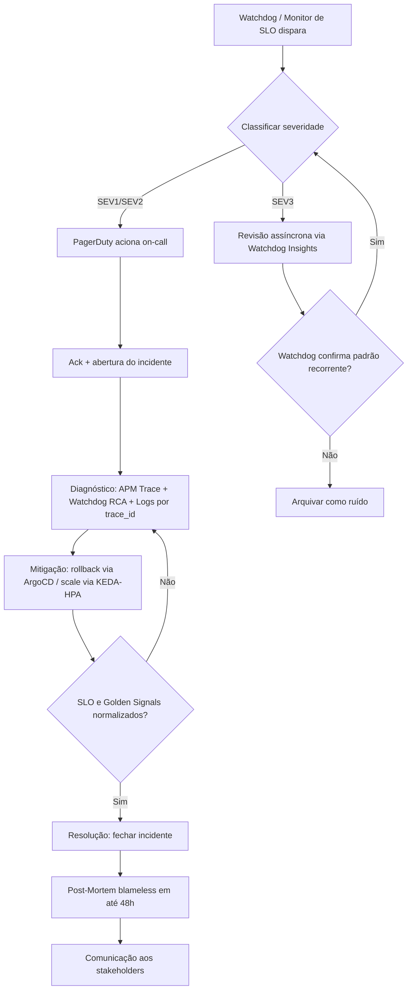

# AIOps e Gestão de Incidentes (ITSM) — Solidary Tech

Ativação das funcionalidades de IA do APM (Datadog Watchdog) e o fluxo de vida de um incidente, da detecção ao post-mortem.

---

## 1. AIOps — Datadog Watchdog

### 1.1. O que já está em "produção" e habilita o Watchdog

O [Watchdog](https://docs.datadoghq.com/monitors/types/watchdog/) é um recurso **nativo da plataforma Datadog**, não um módulo que se instala.

- **Traces:** `otel-collector` exporta para o backend `datadog` (pipeline `traces`, [`otel/configmap.yaml`](../solidary-tech/eks/observability/otel/configmap.yaml)) com `compute_stats_by_span_kind` e `span_name_as_resource_name` habilitados — exatamente os dados que o Watchdog usa para detectar anomalias de latência/erro por serviço e endpoint.
- **Infraestrutura:** `datadog-agent` (DaemonSet) coleta métricas de nó/pod/processo do cluster.
- **Métricas de negócio:** `donations_created_total`, `http_requests_total`, `http_request_duration_seconds` chegam ao Datadog via [`prometheusremotewrite/exporter`](https://github.com/open-telemetry/opentelemetry-collector-contrib/tree/main/exporter/prometheusremotewriteexporter) `datadog` no mesmo `otel-collector`.

Com isso, duas funcionalidades do Watchdog já operam sem nenhuma configuração adicional:
- **Watchdog Insights** (APM → Watchdog): detecção automática de anomalias de erro/latência por serviço, correlacionando deploys e dependências.
- **Watchdog RCA** (Root Cause Analysis): quando um monitor dispara, o Watchdog sugere automaticamente a causa raiz mais provável (ex: deploy recente, dependência degradada) na própria tela do incidente.

### 1.2. O que foi formalizado via IaC

A parte "ativar" que é de fato configurável e versionável é a criação de **monitores baseados detecção de [anomalias](https://docs.datadoghq.com/logs/explorer/watchdog_insights/#log-anomaly-detection) do Watchdog**, em vez de depender só da varredura autônoma do Watchdog — isso dá rastreabilidade (Terraform) e integra com o mesmo canal de alerta já usado pelos outros monitores SRE (`@pagerduty-SolidaryTech`). Foi adicionado o recurso `watchdog_traffic_anomaly` ao módulo existente [`terraform/modules/observability/monitors.tf`](../solidary-tech/terraform/modules/observability/monitors.tf).

Esse monitor usa o mesmo algoritmo de detecção de anomalia do Watchdog (`'basic'`, com janela de comparação histórica), mas como **monitor explícito**, complementando a varredura autônoma — qualquer anomalia de tráfego severa entra no mesmo fluxo de alerta dos monitores de SLO já existentes (`latency`, `slo_burn_rate_alert`).

> Datadog → **APM → Watchdog Insights**.

---

## 2. Fluxo de Vida do Incidente — Solidary Tech

### 2.1. Matriz de severidade

A severidade é derivada diretamente dos SLOs já definidos no [`2_SRE.md`](./2_SRE.md), não de um critério arbitrário — isso evita "alarme falso" e fadiga de alerta:

| Severidade | Gatilho | Exemplo de monitor já existente |
|---|---|---|
| **SEV1** (crítico) | Burn rate do error budget > 14.4x (SLO de disponibilidade em risco real de violação no período) | `datadog_monitor.slo_burn_rate_alert` |
| **SEV2** (degradação) | Latência P99 acima do limiar (`latency_threshold`) por `donation-service` | `datadog_monitor.latency` (`[P2]`) |
| **SEV3** (observação) | Anomalia detectada pelo Watchdog (tráfego, erro) sem violação confirmada de SLO ainda | `datadog_monitor.watchdog_traffic_anomaly` |

### 2.2. Diagrama do fluxo

### 2.3. Etapas detalhadas

**1. Detecção** — automática, via Watchdog (Seção 1) ou monitores de SLO/latência já existentes. Nenhuma etapa manual de "alguém notar" — é esse o ponto central do requisito de gestão *preditiva*: o alerta de burn rate (`14.4x`) avisa **antes** de o SLO mensal ser de fato violado, e não depois.

**2. Triagem / Ack** — o on-call confirma o alerta no PagerDuty (tag `@pagerduty-SolidaryTech`, já usada nos monitores) e classifica a severidade pela matriz acima. Abre-se um canal de incidente dedicado (ex: Slack) para centralizar a comunicação durante a triagem.

**3. Diagnóstico** — é aqui que o stack de observabilidade reduz o MTTI de fato (ver [`2_SRE.md`](./2_SRE.md), Seção 3): o trace raiz no APM mostra exatamente qual span/dependência está degradado (ex: latência no `donation-service` originada de lentidão no RDS, não no SQS), o **Watchdog RCA** já sugere a causa mais provável correlacionando com deploys recentes, e os logs do Loki/Datadog são acessados diretamente pelo `trace_id` do span problemático — sem precisar minerar arquivo de log bruto.

**4. Mitigação** — ação imediata para parar o sangramento do error budget, não necessariamente a correção definitiva:
   - **Rollback:** como o deploy é GitOps (ArgoCD com `selfHeal: true`), revertar o commit da imagem no `eks/deployments/*.yaml` é suficiente — o ArgoCD aplica a reversão sozinho.
   - **Scale:** se o sintoma é saturação (golden signal "saturação"), o KEDA (`donation-service`) ou HPA (`ngo`/`volunteer`) já reagem automaticamente; pode-se também ajustar `maxReplicaCount`/`maxReplicas` manualmente como mitigação temporária.
   - **Limitação atual:** não há *circuit breaker* nem *feature flag* implementados hoje para isolar uma dependência degradada (ex: desligar o envio ao SQS sem afetar a criação da doação) — fica registrado como gap para evolução futura.

**5. Resolução** — confirmar que os Golden Signals (latência, erro, tráfego, saturação) voltaram à faixa normal e que o burn rate do error budget parou de subir, antes de fechar o incidente no PagerDuty.

**6. Post-Mortem (blameless)** — conduzido em até 48h após a resolução, com timeline objetiva (baseada nos timestamps reais dos monitores/traces, não em memória), causa raiz, impacto quantificado (ex: queda em `donations_created_total` durante a janela do incidente, ou % do error budget mensal consumido) e ações de remediação com responsável e prazo. O foco é processo/sistema, não indivíduo.

**7. Comunicação aos stakeholders** — resumo do incidente (impacto, duração, causa, correção) enviado à liderança da ONG e à equipe de engenharia. Hoje isso é feito de forma manual (Slack/e-mail); para um canal mais formal e de baixo custo, dado o orçamento da ONG, a recomendação prática é uma página de status simples (ex: Instatus/Atlassian Statuspage, com plano gratuito para poucos serviços) em vez de construir algo customizado — ainda não implementada, fica como próximo passo.

---

## 3. Resumo executivo

| Item | Status |
|---|---|
| Watchdog (Insights + RCA) | Ativo nativamente — dados de APM/infra já fluem para o Datadog via OTel collector e Datadog Agent |
| Monitor de anomalia formalizado via IaC | Implementado (`watchdog_traffic_anomaly` em `monitors.tf`) |
| Matriz de severidade | Definida, ancorada nos SLOs já documentados em `2_SRE.md` |
| Fluxo de incidente (detecção → post-mortem) | Desenhado, usando os mecanismos já existentes (PagerDuty tag, ArgoCD selfHeal, KEDA/HPA) |
| Gaps conhecidos | Sem circuit breaker/feature flag para isolar dependências; sem página de status para comunicação externa |
