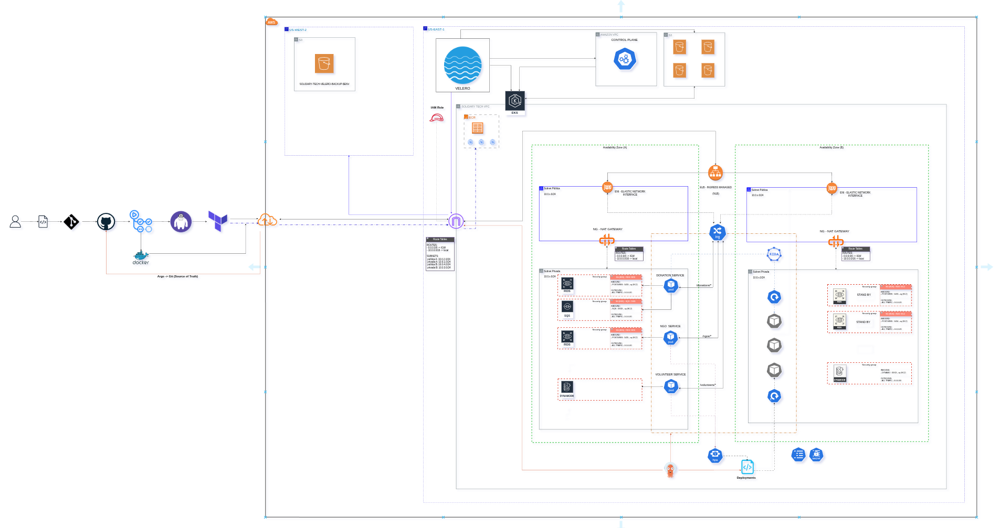
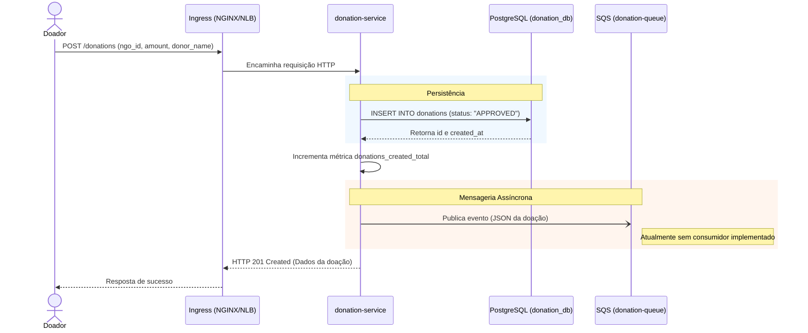
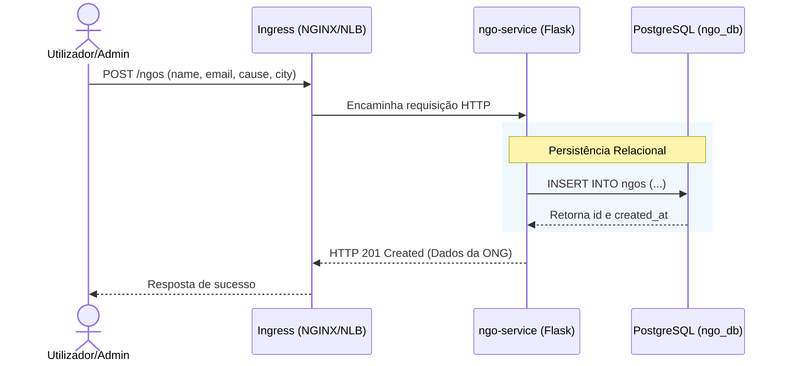
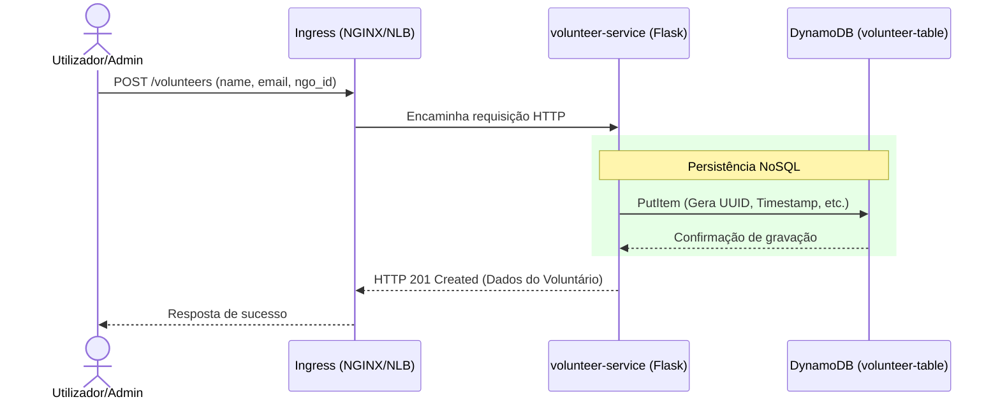

# Arquitetura - Fase 5: Solidary Tech

## 1. Visão Geral da Arquitetura

### 1.1. Arquitetura AWS (Diagrama)


---

## 2. Componentes e Microsserviços

O projeto Solidary Tech é uma plataforma de doações e voluntariado para ONGs estruturada em microsserviços. Abaixo estão as responsabilidades e fluxos de cada componente.

### 2.1. Serviço de Doações (`donation-service`)
* **Linguagem/Framework**: Go
* **Porta**: 8082
* **Banco de Dados**: `donation_db` (PostgreSQL)
* **Integrações**: SQS (`donation-queue`)
* **Responsabilidade**: Gestão do ciclo de vida das doações. (Serviço Crítico de SLO - 99.9%).

**Fluxo de Eventos (Doação):**


### 2.2. Serviço de ONGs (`ngo-service`)
* **Linguagem/Framework**: Python/Flask
* **Porta**: 8081
* **Banco de Dados**: `ngo_db` (PostgreSQL)
* **Computação**: Gunicorn otimizado (2 workers para redução de context switching).
* **Responsabilidade**: Gerenciamento de cadastros, perfis e localizações das ONGs parceiras.

**Fluxo de Eventos (Cadastro de ONG):**


### 2.3. Serviço de Voluntários (`volunteer-service`)
* **Linguagem/Framework**: Python/Flask
* **Porta**: 8083
* **Banco de Dados**: `volunteer-table` (DynamoDB)
* **Computação**: Gunicorn otimizado (2 workers).
* **Responsabilidade**: Cadastro e vinculação de voluntários às ONGs.

**Fluxo de Eventos (Cadastro de Voluntário):**


### 3.1. Estrutura de Dependências e Microsserviços

O projeto Solidary Tech é uma plataforma de doações e voluntariado para ONGs com os seguintes serviços em Go:

```
Estrutura de serviços:

* ngo-service
  - Gerenciamento de ONGs e perfis
  - Porta: 8081
  - Banco: ngo_db (PostgreSQL)

* donation-service
  - Gestão de doações
  - Porta: 8082
  - Banco: donation_db (PostgreSQL)
  - Integrações: SQS (donation-queue)

* volunteer-service
  - Gerenciamento de voluntários
  - Porta: 8083
  - Armazenamento: DynamoDB (volunteer-table)
  - Integrações: SQS
```

### 3.2. Frontend

* **Aplicação React/TypeScript** 
  - Hospedada em S3
  - Configuração dinâmica via arquivo `config.js`
  - Separação de ambientes (dev/prod)

---

## 4. Arquitetura AWS

## 4.1. VPC (Virtual Private Cloud)

### 4.1.1. VPC Principal

```
Nome: solidary-tech-dev-vpc
Faixa de IP: 10.0.0.0/16
Region: us-east-1
Enable DNS Support: true
Enable DNS Hostnames: true

Tags:
  Name = solidary-tech-dev-vpc
```

### 4.1.2. Subnets

Foram criadas 4 subnets distribuídas em 2 zonas de disponibilidade:

```
Subnets Privadas (sem acesso direto à internet, saída via NAT):
 - solidary-tech-dev-private-0
   * CIDR: 10.0.1.0/24
   * Zona: us-east-1a
   * Uso: Nós EKS, RDS

 - solidary-tech-dev-private-1
   * CIDR: 10.0.2.0/24
   * Zona: us-east-1b
   * Uso: Nós EKS, RDS

Subnets Públicas (acesso direto via IGW):
 - solidary-tech-dev-public-0
   * CIDR: 10.0.3.0/24
   * Zona: us-east-1a
   * Uso: NAT Gateway, Bastion (opcional)

 - solidary-tech-dev-public-1
   * CIDR: 10.0.4.0/24
   * Zona: us-east-1b
   * Uso: NAT Gateway
```

### 4.1.3. Internet Gateway (IGW)

```
Nome: solidary-tech-dev-igw
Propósito: Acesso à internet das subnets públicas
Associação: solidary-tech-dev-vpc
```

### 4.1.4. NAT Gateway

```
Nome: solidary-tech-dev-nat
Localização: Subnet pública (10.0.3.0/24 em us-east-1a)
Elastic IP: Alocado automaticamente
Propósito: Acesso à internet dos recursos em subnets privadas
```

### 4.1.5. Route Tables

#### Rota Pública (RTB)
```
Nome: solidary-tech-dev-public-rt
Destino: VPC (10.0.0.0/16) → Local
Destino: Internet (0.0.0.0/0) → IGW

Associações:
 - solidary-tech-dev-public-0 (10.0.3.0/24)
 - solidary-tech-dev-public-1 (10.0.4.0/24)
```

#### Rota Privada (RTB)
```
Nome: solidary-tech-dev-private-rt
Destino: VPC (10.0.0.0/16) → Local
Destino: Internet (0.0.0.0/0) → NAT Gateway

Associações:
 - solidary-tech-dev-private-0 (10.0.1.0/24)
 - solidary-tech-dev-private-1 (10.0.2.0/24)
```

---

## 4.2. EKS (Elastic Kubernetes Service)

### 4.2.1. Cluster Kubernetes

Foi criado o cluster EKS `solidary-tech-eks` com as seguintes características:

```
Nome: solidary-tech-eks
Região: us-east-1
Versão Kubernetes: 1.34
Endpoint: Privado (não acessível publicamente)
VPC: solidary-tech-dev-vpc (10.0.0.0/16)
Subnets: Apenas subnets privadas (10.0.1.0/24, 10.0.2.0/24)

Acesso:
 - Control Plane: Privado
 - Acesso via Bastion: SSH Tunnel para localhost:6443
 - IAM Role: LabRole (role padrão da AWS)

Encriptação:
 - Secrets em etcd: Desabilitado (por padrão no ambiente dev)
 - Recomendação: Habilitar em produção
```

#### 4.2.1.1. Security Groups

```
Cluster Security Group:
 - Ingresso: Bastion Security Group na porta 443 (HTTPS)
 - Egresso: Qualquer lugar
```

### 4.2.2. Node Group

Foi criado um Node Group com a seguinte configuração:

```
Nome: solidary-tech-ng
Tipo de Instância: t3.medium
AMI Type: Amazon Linux 2 (otimizado para EKS)

Dimensionamento:
 - Desired size: 2 (2 nós ativos)
 - Minimum size: 1
 - Maximum size: 2
 
Subnets de implantação:
 - solidary-tech-dev-private-0 (10.0.1.0/24 em us-east-1a)
 - solidary-tech-dev-private-1 (10.0.2.0/24 em us-east-1b)

IAM Role:
 - LabRole (role padrão AWS)

Recursos por Nó (t3.medium):
 - CPU: 2 vCPUs
 - Memória: 4 GB
 - Network: Até 5 Gbps

Tags FinOps:
 - Project: solidary-tech
 - Environment: Development
 - CostCenter: NGO-Core
 - ManagedBy: Terraform
```

### 4.2.3. Bastion Host (EC2)

Para acesso seguro ao cluster e execução de migrations:

```
Nome: solidary-tech-dev-bastion
Tipo de Instância: t3.small
AMI: ami-0b6c6ebed2801a5cb (Ubuntu Server 24.04 x64)
Subnet: Pública (10.0.3.0/24 em us-east-1a)
Key Pair: iac-key

Security Group:
 - Ingresso SSH: De específico (GitHub Actions IP)
 - Egresso: 443 para EKS API

Propósito:
 - Túnel SSH para acesso ao EKS (localhost:6443)
 - Execução de migrations de banco de dados
 - Acesso administrativo seguro
```

---

## 4.3. ECR (Elastic Container Registry)

Foram criados repositórios no ECR para armazenar imagens dos serviços:

```
Repositório: {ACCOUNT_ID}.dkr.ecr.us-east-1.amazonaws.com/solidary-tech/

Imagens armazenadas:
 - donation-service
 - ngo-service
 - volunteer-service

Política de tags:
 - Commit SHA: {service-name}-{git-sha}
 - Latest: {service-name}-latest
 - Migration Images: {service-name}-migration-{git-sha}

Configuração:
 - Image scanning: Habilitado
 - Scan em push: Ativado
 - Falha em CRITICAL: Sim
 - Retenção: Automática (últimas 10 imagens)
 - Encriptação: AES256 (padrão)

Exemplo de imagem:
 608737466163.dkr.ecr.us-east-1.amazonaws.com/solidary-tech:donation-service-04c69f1111ab1851ae45e2ee9f8a4be7f05cacc9
```

---

## 4.4. RDS (Relational Database Service)

Foram criados dois bancos de dados PostgreSQL para aplicação:

```
Configuração Geral:
 - Engine: PostgreSQL 15
 - Classe de instância: db.t3.micro (Homologação)
 - Storage: 20 GB (SSD / GP2)
 - Backup: Habilitado (retenção: 7 dias)
 - Multi-AZ: Desabilitado (ambiente dev)
 - Encryption: Habilitado (AES256)

Databases:

1. donation-db
   - Nome do banco: donation_db
   - Usuário master: postgres
   - Porta: 5432
   - Dono da aplicação: donation-service
   - Propósito: Armazenar doações, NGOs, notificações
   - Tabelas principais:
     * donations (id, ngo_id, amount, donor_name, status, created_at)

2. ngo-db
   - Nome do banco: ngo_db
   - Usuário master: postgres
   - Porta: 5432
   - Dono da aplicação: ngo-service
   - Propósito: Dados das ONGs, perfis, configurações
   - Tabelas principais:
     * ngos
     * ngo_profiles
     * locations

Security Group:
 - Ingresso: Porta 5432 apenas de nós do EKS
 - Egresso: Sem restrições
 - Baseado em Security Group (não IP direto)

Backup:
 - Retenção: 7 dias
 - Janela: 03:00-04:00 UTC
 - Snapshots: Manuais antes de mudanças críticas

Tags: 
 - Project: solidary-tech
 - Environment: Development
 - CostCenter: NGO-Core
```

## 4.5. SQS (Simple Queue Service)

Foram criadas filas para processamento assíncrono:

```
Fila: donation-queue

Configuração:
 - Tipo: Standard (not FIFO)
 - Retenção de mensagens: 86.400 segundos (1 dia)
 - Visibility timeout: 30 segundos
 - Dead Letter Queue (DLQ): Habilitada
 - Max Receive Count: 3 (movido para DLQ após 3 tentativas)
 - Encriptação: KMS (padrão AWS)

Propósito:
 - Fila de eventos de doações
 - Processamento assíncrono de notificações
 - Desacoplamento entre donation-service e consumers

Produtores:
 - donation-service: ao criar/atualizar doações

Consumidores:
 - Workers: processa notificações

Local (desenvolvimento):
 - Localstack (container)
 - Endpoint: http://localstack:4566/000000000000/donation-queue
```

---

## 4.6. DynamoDB

Foram criadas tabelas NoSQL para armazenamento de voluntários:

```
Tabela: volunteer-table

Schema:
 - Partition Key (Hash): volunteer_id (String)
 - Sort Key: None

Modo de Capacidade:
 - PAY_PER_REQUEST (On-Demand)
 - Escalável automaticamente conforme uso

Propósito:
 - Armazenar perfis de voluntários
 - Cache de dados frequentemente acessados

TTL: Não configurado (dados persistentes)

Encriptação: Habilitada (padrão AWS)

Local (desenvolvimento):
 - Localstack (container)
 - Criação automática via init-aws.sh
```

---

## 4.7. S3 (Simple Storage Service)

### 4.7.1. State Bucket (Terraform/Terragrunt)

```
Bucket: solidary-iac-state
Propósito: Armazenar state do Terraform/Terragrunt

Configuração:
 - Versionamento: Habilitado (proteção contra sobrescrita)
 - Encriptação: AES256 (padrão AWS)
 - Acesso: Apenas via IAM (nenhum acesso público)
 - Force Destroy: Habilitado (para ambiente de dev)
 - Backend Lock Table: terraform-locks (DynamoDB)

Estrutura:
 solidary-iac-state/
  ├── environments/dev/terraform.tfstate
  ├── observability/dev/terraform.tfstate
  ├── db-migrations/dev/terraform.tfstate
  └── ...
```

### 4.7.2. Frontend Buckets

```
Buckets:
 - solidary-tech-dev-app: Frontend em desenvolvimento
 - solidary-tech-prod-app: Frontend em produção

Configuração:
 - Versionamento: Habilitado
 - Acesso público: BlockPublicAccess ativado
 - Website hosting: Habilitado (index.html)
 - CORS: Configurado para requisições da API

Propósito:
 - Hostedar aplicação React/TypeScript
 - Sincronização via CI/CD (GitHub Actions)
 - Arquivo config.js gerado dinamicamente
```

---

## 5. Segurança

### 5.1. Network Security

```
Security Groups:

EKS Cluster:
 - Ingresso: Bastion SG na porta 443
 - Egresso: Sem restrições

RDS:
 - Ingresso: EKS Cluster SG na porta 5432
 - Egresso: N/A

Bastion:
 - Ingresso: SSH (porta 22) de GitHub Actions
 - Egresso: 443 para EKS API

Padrão: Todos permitem egresso ilimitado
```

### 5.2. IAM & Acesso

```
LabRole: Role padrão do lab AWS
 - Assumida por: EKS cluster, nodes, Bastion
 - Permissões: Full access (ambiente de lab)

GitHub Actions:
 - Credenciais via environment secrets
 - AWS_ACCESS_KEY_ID, AWS_SECRET_ACCESS_KEY
 - AWS_SESSION_TOKEN (se STS temporário)
 - AWS_REGION: us-east-1
```

### 5.3. Image Security

```
ECR Scanning:

 - Trivy durante build em GitHub Actions
 - Severity: CRITICAL (falha se encontrado)
 - Re-scan automático de imagens no ECR
```
