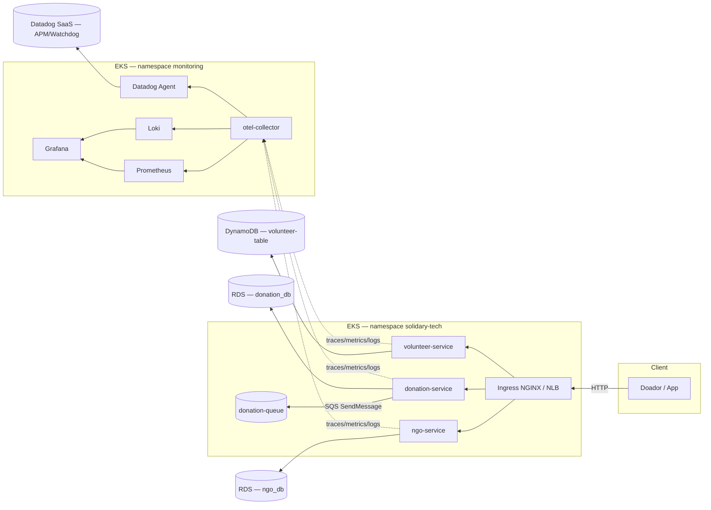

# Arquitetura

## Visão geral

## Componentes de negócio

| Serviço | Linguagem | Persistência | Responsabilidade |
|---|---|---|---|
| `donation-service` | Go | PostgreSQL (RDS) + SQS (evento de notificação) | Cria e lista doações; é o serviço crítico de SLO (jornada de doação ponta a ponta) |
| `ngo-service` | Python/Flask | PostgreSQL (RDS) | Cadastro e listagem de ONGs parceiras |
| `volunteer-service` | Python/Flask | DynamoDB | Cadastro e listagem de voluntários por ONG |

Detalhes de endpoints em [Guia de APIs e Serviços](./how-to/apis-services.md).

## Infraestrutura

Toda a infraestrutura é provisionada via **Terraform**, orquestrada por **Terragrunt** (módulos em `terraform/modules/`, ambientes em `terraform/environments/`): VPC, EKS, RDS, DynamoDB, SQS, ECR, EC2 (bastion) e o módulo de observabilidade (Datadog via Terraform provider). Ver [Infraestrutura](./infra/terraform-terragrunt.md).

## Entrega contínua

- **CI** (GitHub Actions): testes, lint, SAST (Gosec/Bandit), SCA (Trivy), build e push de imagem para ECR — uma esteira por serviço.
- **CD da infraestrutura**: workflow dedicada de Terraform/Terragrunt que também instala os add-ons de cluster (ArgoCD, Metrics Server, KEDA, ingress-nginx).
- **CD da aplicação**: GitOps puro via **ArgoCD**, sincronizando o diretório `eks/` do repositório, com `selfHeal` e `prune` habilitados.

Detalhes completos em [CI/CD](./infra/pipelines-cicd.md).

## Scaling

- `donation-service`: **KEDA**, escalando por tráfego HTTP (Prometheus) com CPU como gatilho de segurança — por ser o serviço crítico de SLO.
- `ngo-service` / `volunteer-service`: HPA nativo do Kubernetes, por CPU.

Justificativa completa, incluindo por que scaling por fila (SQS) não é viável hoje (ausência de consumidor), em [Right Sizing][1].

## Observabilidade

Stack híbrida: **Prometheus + Loki + Grafana** (open-source, no cluster) e **Datadog** (APM, Watchdog/AIOps, dashboards de SRE), ambos alimentados pelo mesmo **OpenTelemetry Collector** — um único ponto de instrumentação nos serviços (Go: `otelhttp` + OTLP gRPC; Python: `opentelemetry-instrumentation-flask`), dois destinos. Ver [Observabilidade e AIOps](./observability.md).

[1]: https://github.com/rodx64/pos_arch/blob/develop/fase_5/tech_challenge/doc/4_RIGHTSIZING.md
