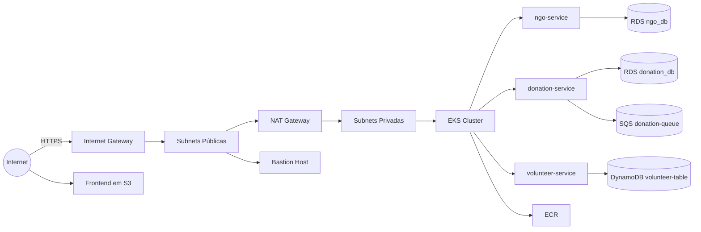
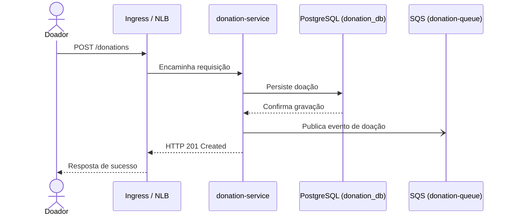
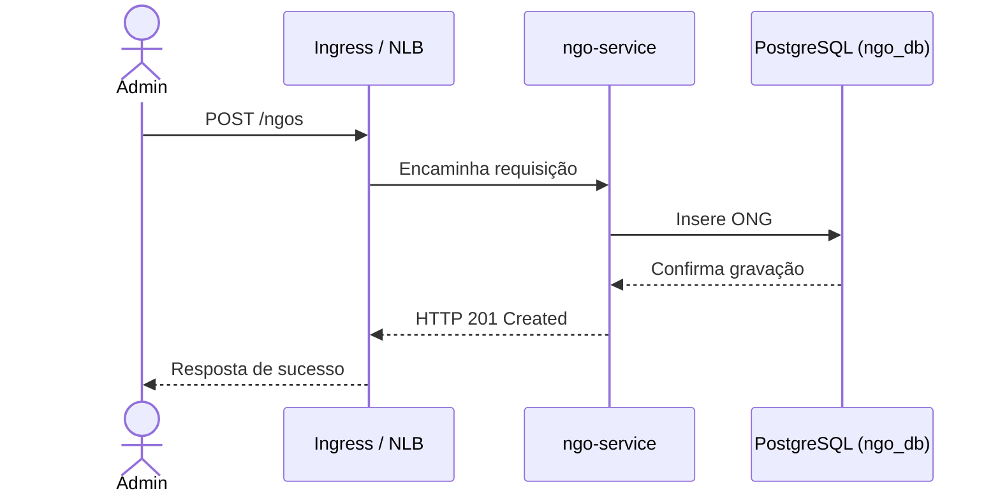
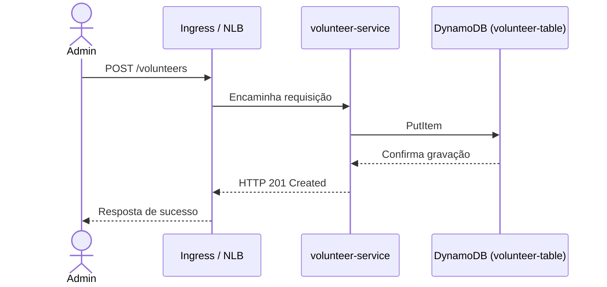

# Arquitetura

## Visão Geral

A plataforma Solidary Tech é organizada em microsserviços executados no EKS, com persistência relacional para ONGs e doações, NoSQL para voluntários e eventos assíncronos por fila SQS. A imagem abaixo consolida o panorama principal da arquitetura AWS implementada na fase 5.

```mermaid
flowchart LR
    Internet((Internet)) -->|HTTPS| IGW[Internet Gateway]
    IGW --> Public[Subnets Públicas]
    Public --> NAT[NAT Gateway]
    Public --> Bastion[Bastion Host]
    NAT --> Private[Subnets Privadas]
    Private --> EKS[EKS Cluster]

    EKS --> NGO[ngo-service]
    EKS --> DON[donation-service]
    EKS --> VOL[volunteer-service]

    NGO --> RDSNGO[(RDS ngo_db)]
    DON --> RDSDON[(RDS donation_db)]
    DON --> SQS[(SQS donation-queue)]
    VOL --> DDB[(DynamoDB volunteer-table)]
    EKS --> ECR[ECR]
    Internet --> Frontend[Frontend em S3]
```

## Componentes de Negócio

| Serviço | Linguagem | Persistência | Responsabilidade |
|---|---|---|---|
| `donation-service` | Go | PostgreSQL (RDS) + SQS | Gerencia o ciclo de vida das doações e é o serviço crítico de SLO (99.9%) |
| `ngo-service` | Python/Flask | PostgreSQL (RDS) | Cadastro e listagem de ONGs parceiras |
| `volunteer-service` | Python/Flask | DynamoDB | Cadastro e vinculação de voluntários às ONGs |

Detalhes de endpoints e contratos em [Guia de APIs e Serviços](./how-to/apis-services.md).

## Fluxos Principais

### 1. Fluxo de doação

```mermaid
sequenceDiagram
    actor Doador
    participant Ingress as Ingress / NLB
    participant DonationAPI as donation-service
    participant DB as PostgreSQL (donation_db)
    participant SQS as SQS (donation-queue)

    Doador->>Ingress: POST /donations
    Ingress->>DonationAPI: Encaminha requisição
    DonationAPI->>DB: Persiste doação
    DB-->>DonationAPI: Confirma gravação
    DonationAPI-)SQS: Publica evento de doação
    DonationAPI-->>Ingress: HTTP 201 Created
    Ingress-->>Doador: Resposta de sucesso
```

### 2. Fluxo de cadastro de ONG

```mermaid
sequenceDiagram
    actor Admin
    participant Ingress as Ingress / NLB
    participant NgoAPI as ngo-service
    participant DB as PostgreSQL (ngo_db)

    Admin->>Ingress: POST /ngos
    Ingress->>NgoAPI: Encaminha requisição
    NgoAPI->>DB: Insere ONG
    DB-->>NgoAPI: Confirma gravação
    NgoAPI-->>Ingress: HTTP 201 Created
    Ingress-->>Admin: Resposta de sucesso
```

### 3. Fluxo de cadastro de voluntário

```mermaid
sequenceDiagram
    actor Admin
    participant Ingress as Ingress / NLB
    participant VolAPI as volunteer-service
    participant Dynamo as DynamoDB (volunteer-table)

    Admin->>Ingress: POST /volunteers
    Ingress->>VolAPI: Encaminha requisição
    VolAPI->>Dynamo: PutItem
    Dynamo-->>VolAPI: Confirma gravação
    VolAPI-->>Ingress: HTTP 201 Created
    Ingress-->>Admin: Resposta de sucesso
```

## Infraestrutura AWS

A infraestrutura é provisionada via Terraform/Terragrunt e cobre os principais blocos abaixo:

- **VPC**: rede principal `10.0.0.0/16`, com subnets públicas e privadas distribuídas em duas zonas de disponibilidade.
- **EKS**: cluster `solidary-tech-eks`, com endpoint privado, acesso via bastion e node group `solidary-tech-ng`.
- **RDS**: dois bancos PostgreSQL (`donation_db` e `ngo_db`) com backup e isolamento por security group.
- **SQS**: fila `donation-queue` para eventos assíncronos de doação.
- **DynamoDB**: tabela `volunteer-table` para persistência de voluntários.
- **S3**: buckets para frontend e para o estado do Terraform/Terragrunt.
- **ECR**: repositórios por serviço com scan de imagens e tagging por commit SHA.

## Segurança e acesso

- **Bastion Host**: utilizado para acesso administrativo ao cluster EKS e execução de migrations.
- **Security Groups**: restrição de entrada para RDS e EKS, com acessos controlados por bastion e pelo cluster.
- **IAM**: uso da `LabRole` no ambiente de laboratório e credenciais temporárias via GitHub Actions.
- **Image Security**: integração com Trivy para escaneamento de imagens no ECR.

## Outros temas da documentação

Os tópicos abaixo não foram incorporados diretamente ao diagrama, mas continuam documentados neste portal:

- [Infraestrutura](./infra/terraform-terragrunt.md) — módulos Terraform/Terragrunt, estado remoto, tagging e backup.
- [CI/CD](./infra/pipelines-cicd.md) — pipelines de build, deploy e GitOps com ArgoCD.
- [Observabilidade](./observability.md) — Prometheus, Loki, OpenTelemetry e Datadog.
- [SRE](./sre.md) — SLIs/SLOs, budget error e confiabilidade.
- [FinOps](./finops.md) — rightsizing, scaling e forecast de custos.
- [Disaster Recovery e PCN](./disaster-recovery.md) — backup cross-region e recuperação.

## Escalabilidade e operação

- `donation-service`: escalonamento com **KEDA** por tráfego HTTP e CPU como proteção.
- `ngo-service` e `volunteer-service`: HPA nativo do Kubernetes por CPU.
- A documentação operacional completa, incluindo os motivos da decisão de scaling e as métricas, está disponível em [FinOps](./finops.md).
