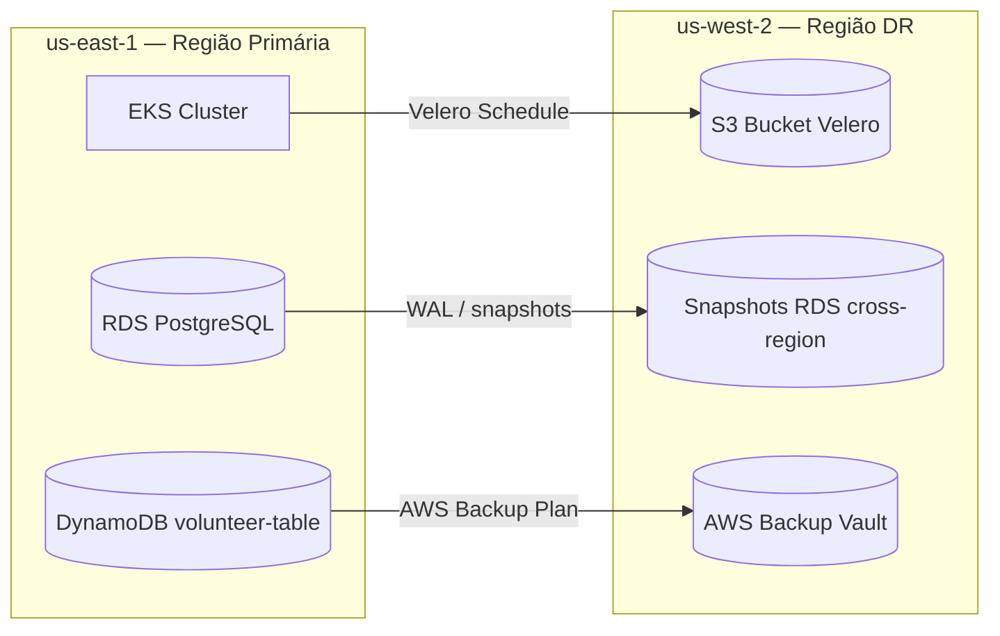

# Recuperação de Desastre e PCN

## Visão Geral e Objetivo

A Solidary Tech adotou a estratégia de recuperação de desastre baseada em backup cross-region com Velero como mecanismo principal de continuidade de negócios. O objetivo é garantir que a plataforma sobreviva a falhas catastróficas no cluster principal do EKS ou na região primária da AWS, reduzindo ao máximo a perda de dados financeiros e o tempo de indisponibilidade.

> A decisão foi priorizar uma abordagem resiliente, mas com custo operacional sustentável para a organização, evitando a necessidade de manter um ambiente ativo-passivo o tempo todo.

## Decisão Estratégica

A engenharia avaliou duas abordagens:

- **Opção A — Backup cross-region com Velero e snapshots de dados**: provisiona a infraestrutura de recuperação apenas quando necessário.
- **Opção B — Warm standby ativo-passivo**: mantém um ambiente espelho em outra região, porém com custo contínuo mais elevado.

A escolha da Solidary Tech foi pela **Opção A**, pois ela oferece o melhor equilíbrio entre continuidade operacional, governança e responsabilidade financeira. Manter um cluster espelho em segunda região exigiria pagamento contínuo por control plane, node groups, load balancers e bancos em execução ociosa.

## Métricas Críticas: RTO e RPO

Para contextualizar as escolhas de recuperação, vale lembrar que:
- **RPO** (Recovery Point Objective) indica a quantidade máxima de dados que pode ser perdida em um incidente
- **RTO** (Recovery Time Objective) mede o tempo máximo para a plataforma voltar a operar. 

| Componente | RPO | RTO | Estratégia de proteção |
|---|---:|---:|---|
| **Doações** (`donation-service`) | **15 min** | **2 horas** | RDS com cópia cross-region |
| **Dados cadastrais** (NGO e Volunteer) | **24 horas** | **4 horas** | Backup diário realizado pelo Velero e backup do DynamoDB |

O RPO de 24 horas para dados cadastrais reflete a cadência real do schedule do Velero, executado diariamente às 03:00 UTC.

## Arquitetura de Proteção



### 1. Estado do cluster com Velero

- O Velero é instalado no cluster EKS em modo sem credenciais estáticas, autenticando via IRSA com a `LabRole`.
- O schedule é aplicado via GitOps e executa diariamente às **03:00 UTC**.
- Os namespaces cobertos incluem `solidary-tech`, `monitoring`, `argocd` e `keda`.
- O backup possui TTL de **30 dias**, enquanto o bucket S3 mantém retenção de **90 dias**.
- O destino dos backups fica na região secundária `us-west-2`.

### 2. Dados persistentes

- **RDS PostgreSQL**: snapshots automatizados com cópia cross-region para sustentar o RPO de 15 minutos para o serviço de doações.
- **DynamoDB**: proteção via AWS Backup com execução diária e retenção alinhada ao lifecycle do bucket.
- **SQS**: ainda é um ponto de atenção, pois a fila não possui backup cross-region nativo e mensagens em trânsito podem ser perdidas no momento do desastre.

## Procedimento de Recuperação

1. **Provisionar infraestrutura na região de DR**: executar o pipeline de infraestrutura apontando para a região secundária.
2. **Garantir o bucket de backups**: o módulo de Velero provisiona o bucket antes da restauração.
3. **Reinstalar o Velero**: no novo cluster, com o mesmo bucket e permissões de acesso.
4. **Restaurar o estado do cluster**: executar o restore a partir do backup mais recente.
5. **Sincronizar o ArgoCD e o tráfego**: validar o estado GitOps e restabelecer o ingress via novo NLB.

### Runbook resumido

```bash
velero backup get
velero restore create --from-backup <ultimo-backup>
velero restore describe <nome-do-restore> --details
```

## Pontos de Atenção e Gaps

- **SQS sem backup cross-region equivalente**: há risco de perda de mensagens em trânsito.
- **Exercício de DR não executado ainda**: o RTO de 2 horas permanece uma estimativa operacional até a validação prática.
- **Governança contínua**: a execução periódica do restore drill é recomendada para confirmar que o processo permanece viável.

## Referências

- Backup schedule do Velero
- Módulo Terraform de Velero
- Módulo Terraform de backup do DynamoDB
- Pipeline de infraestrutura do repositório
