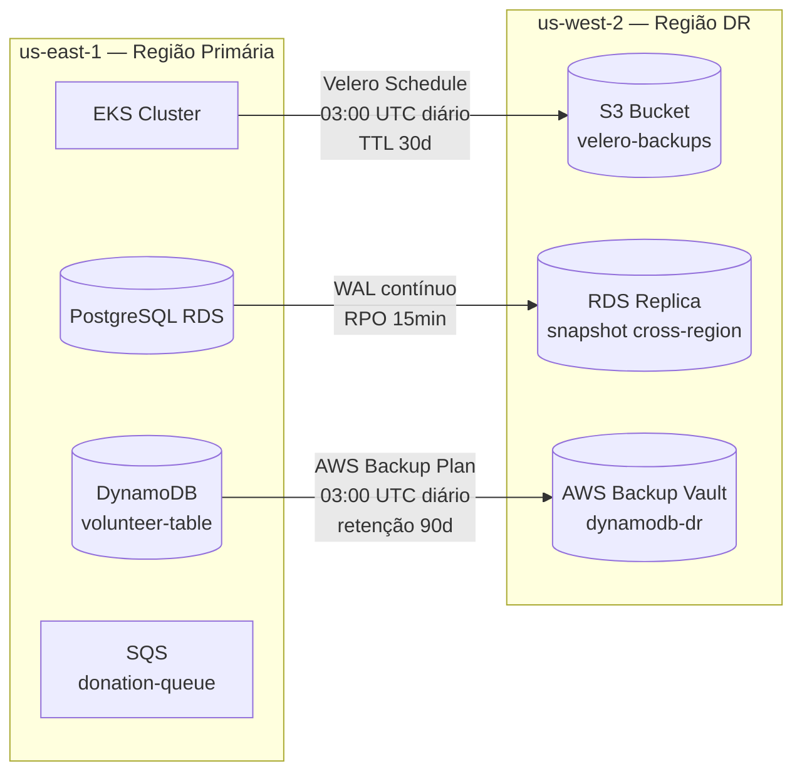

# Disaster Recovery e PCN

## Visão Geral e Objetivo

A Solidary Tech adota a **Opção A — Backup Cross-Region com Velero** como estratégia de Disaster Recovery. O objetivo é garantir que a plataforma sobreviva a falhas catastróficas no cluster principal (EKS) ou na região primária da AWS (`us-east-1`), minimizando a perda de dados financeiros (doações) e o tempo de inatividade.

### Por que não Ativo-Passivo (Opção B)?

Manter um ambiente espelho em segunda região exigiria pagar continuamente por um Control Plane de EKS, Node Groups, Load Balancers e instâncias de banco ociosos. A Opção A, combinada com a automação de IaC (Terraform/Terragrunt) integrada ao CI/CD, permite **levantar o ambiente de recuperação apenas no momento do desastre** — o melhor equilíbrio entre resiliência técnica e responsabilidade financeira de uma ONG.

---

## Métricas Críticas: RTO e RPO

| Dado | RPO | RTO | Mecanismo |
|---|---|---|---|
| **Doações** (`donation-service` — PostgreSQL/SQS) | **15 min** | **2 horas** | WAL contínuo do RDS replicado cross-region |
| **Cadastrais** (NGO e Volunteer — PostgreSQL/DynamoDB) | **24 horas** | **4 horas** | Backup diário do Velero (03:00 UTC) + AWS Backup para DynamoDB |

> O RPO de 24h para dados cadastrais é determinado pela cadência do `Schedule` do Velero (`backup-schedule.yaml`, diário às 03:00 UTC) — o mecanismo de proteção vigente para esses dados. Não existe rotina de snapshot independente nesse intervalo.

---

## Arquitetura de Backup



### Dois mecanismos independentes por camada

**1. Estado do Cluster (Velero)**

O Velero é instalado no cluster EKS em modo `--no-secret`, autenticando via IRSA com a `LabRole` (sem credenciais estáticas). O `velero install` inclui `--snapshot-location-config region=us-east-1` — obrigatório pelo plugin AWS mesmo com `snapshotVolumes: false`, pois o plugin exige a configuração do snapshot location na instalação. O `Schedule` diário é sincronizado pelo ArgoCD a partir de [`eks/velero/backup-schedule.yaml`][velero-schedule]:

- **Namespaces cobertos:** `solidary-tech`, `monitoring`, `argocd`, `keda` — cobrindo aplicação, observabilidade, GitOps e scaling
- **TTL por backup:** 30 dias (controlado pelo Velero)
- **Retenção no bucket:** 90 dias (lifecycle S3 — camada de auditoria, sempre ≥ TTL)
- **`snapshotVolumes: false`** — declarado explicitamente; nenhum serviço usa PVC hoje. Alterar para `true` se algum PVC for introduzido
- **Bucket S3 de destino:** `solidary-tech-velero-backups-{env}` em `us-west-2`, provisionado pelo módulo [`terraform/modules/velero`][tf-velero]

**2. Dados de Aplicação (RDS + DynamoDB via AWS Backup)**

- **PostgreSQL (RDS):** snapshots automatizados com cópia cross-region ativada para `us-west-2`, sustentando o RPO de 15 min do `donation-service`
- **DynamoDB (`volunteer-table`):** protegida pelo módulo [`terraform/modules/backup`][tf-awsbackup], instanciado via [`backup/dev/terragrunt.hcl`][tg-awsbackup]. Executa diariamente às 03:00 UTC, cópia cross-region para `us-west-2`, retenção de 90 dias — mesma janela e retenção do bucket do Velero, por consistência de governança

> **Gap remanescente — SQS:** AWS Backup não suporta SQS nativamente. Mensagens em trânsito no momento de um desastre podem ser perdidas. A mitigação atual depende da capacidade de reprocessamento do produtor; avaliar DLQ com replicação de aplicação se o RPO de 15 min precisar cobrir a fila.

---

## Ciclo de Vida da Infraestrutura de DR no Pipeline

A ordem de execução no pipeline `ci-infra.yml` garante que o bucket exista antes do Velero ser instalado:

```
apply (infra base EKS)
  └─► velero-infra (terragrunt apply → cria bucket S3 em us-west-2)
        └─► cluster-addons (velero install → aponta pro bucket)
              └─► argocd-app (sync GitOps → aplica backup-schedule.yaml)
```

---

## Runbook de Recuperação

### Pré-requisito: identificar o último backup válido

```bash
velero backup get --label-selector app.kubernetes.io/part-of=solidary-tech
# ou simplesmente:
velero backup get
```

### Passo 1 — Provisionar nova infraestrutura na região de DR

Acionar o pipeline `ci-infra.yml` via `workflow_dispatch`, apontando para a região de DR:

```bash
# Alterar temporariamente a variável de ambiente no workflow,
# ou sobrescrever via input do workflow_dispatch:
TERRAGRUNT_DIR=fase_5/tech_challenge/solidary-tech/terraform/environments/dr
```

O Terraform provisiona um novo EKS e toda a infraestrutura base limpa em `us-west-2`.

### Passo 2 — Garantir bucket de backup acessível

O job `velero-infra` do mesmo pipeline executa `terragrunt apply` sobre `modules/velero`, garantindo que o bucket `solidary-tech-velero-backups-{env}` em `us-west-2` exista e esteja acessível.

### Passo 3 — Restaurar estado do cluster

O job `cluster-addons` reinstala o Velero no novo cluster, apontando para o mesmo bucket. Em seguida, executar manualmente:

```bash
# Listar backups disponíveis
velero backup get

# Restaurar a partir do backup mais recente
velero restore create --from-backup <nome-do-ultimo-backup>

# Acompanhar o progresso
velero restore describe <nome-do-restore> --details
```

Isso reidrata os namespaces `solidary-tech`, `monitoring`, `argocd` e `keda`.

### Passo 4 — Sincronização final via ArgoCD

O ArgoCD, restaurado pelo Velero no passo anterior, assume o controle:
- Valida que o estado do cluster está sincronizado com o repositório `eks/`
- O job `update-ingress-host` do pipeline injeta o novo DNS do NLB na região de DR
- Tráfego é restabelecido via novo Ingress

### Passo 5 — Restaurar dados (RDS/DynamoDB)

- **PostgreSQL:** restaurar a partir do snapshot cross-region mais próximo do ponto de falha (RPO 15 min)
- **DynamoDB:** restaurar do vault `solidary-tech-dynamodb-backup-dr-{env}` em `us-west-2` via AWS Backup Console ou CLI

---

## Gaps Identificados

| Gap | Impacto | Status |
|---|---|---|
| **SQS sem backup cross-region** | Perda de mensagens em trânsito no momento do desastre | Aberto — AWS Backup não suporta SQS |
| **Restore drill não executado** | RTO de 2h é estimativa, não garantia operacional medida | Aberto — recomenda-se exercício periódico de DR |

---

## Referências

- [`eks/velero/backup-schedule.yaml`][velero-schedule] — Schedule do Velero (GitOps)
- [`terraform/modules/velero`][tf-velero] — Módulo Terraform do bucket S3 de backup
- [`terraform/modules/backup`][tf-awsbackup] — Módulo Terraform do AWS Backup para DynamoDB
- [`velero/dev/terragrunt.hcl`][tg-velero] — Instância Terragrunt do módulo Velero
- [`backup/dev/terragrunt.hcl`][tg-awsbackup] — Instância Terragrunt do AWS Backup
- [`.github/workflows/ci-infra.yml`][ci-infra] — Pipeline CI/CD de infraestrutura

[velero-schedule]: https://github.com/rodx64/pos_arch/blob/develop/fase_5/tech_challenge/solidary-tech/eks/velero/backup-schedule.yaml
[tf-velero]: https://github.com/rodx64/pos_arch/tree/develop/fase_5/tech_challenge/solidary-tech/terraform/modules/velero
[tf-awsbackup]: https://github.com/rodx64/pos_arch/tree/develop/fase_5/tech_challenge/solidary-tech/terraform/modules/backup
[tg-velero]: https://github.com/rodx64/pos_arch/blob/develop/fase_5/tech_challenge/solidary-tech/velero/dev/terragrunt.hcl
[tg-awsbackup]: https://github.com/rodx64/pos_arch/blob/develop/fase_5/tech_challenge/solidary-tech/backup/dev/terragrunt.hcl
[ci-infra]: https://github.com/rodx64/pos_arch/blob/develop/.github/workflows/ci-infra.yml
