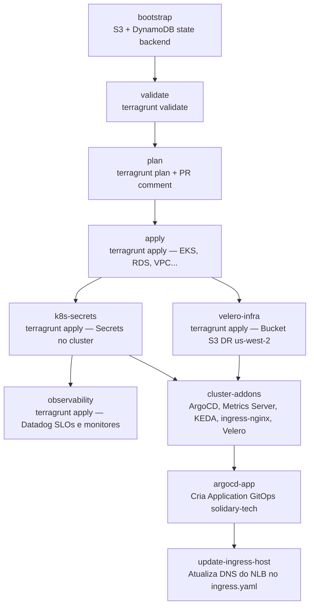

# CI/CD e Pipelines

A automação de entrega é inteiramente baseada em **GitHub Actions**, com quatro workflows independentes: um por serviço de aplicação e um para infraestrutura.

## Workflows

| Workflow | Arquivo | Disparo | Responsabilidade |
|---|---|---|---|
| **CI/CD — Infra** | [`ci-infra.yml`][ci-infra] | Push em `terraform/**` ou manual | Provisiona toda a infra, instala add-ons, faz deploy GitOps |
| **CI/CD — Donation** | [`ci-donation.yml`][ci-donation] | Push em `donation-service/**` | Testa, lint, SAST, SCA, build, push ECR, atualiza tag |
| **CI/CD — NGO** | [`ci-ngo.yml`][ci-ngo] | Push em `ngo-service/**` | Idem para ngo-service |
| **CI/CD — Volunteer** | [`ci-volunteer.yml`][ci-volunteer] | Push em `volunteer-service/**` | Idem para volunteer-service |

## Fluxo do CI/CD de Infraestrutura



### Detalhe dos jobs críticos

**`observability`** executa em paralelo ao `cluster-addons` (ambos dependem de `k8s-secrets`). Roda `terragrunt apply` sobre o módulo `modules/observability`, que provisiona via provider Datadog: SLOs de disponibilidade e jornada, monitores de burn rate e latência, e o monitor de anomalia de tráfego (Watchdog). Os valores de target, percentil e limiar são injetados via `slo_services` no `observability/dev/terragrunt.hcl`.

**`velero-infra`** executa **antes** de `cluster-addons` (dependência explícita: `needs: [k8s-secrets, velero-infra]`), garantindo que o bucket S3 de backup em `us-west-2` exista antes que o `velero install` aponte para ele.

**`cluster-addons`** instala os add-ons de cluster de forma idempotente — cada add-on verifica se já está instalado antes de instalar:

```bash
if kubectl get deployment velero -n velero &>/dev/null; then
  echo "Velero já instalado — pulando instalação."
else
  velero install --provider aws --plugins velero/velero-plugin-for-aws:v1.9.0 \
    --bucket solidary-tech-velero-backups-dev \
    --backup-location-config region=us-west-2 \
    --no-secret \
    --sa-annotations eks.amazonaws.com/role-arn=${ROLE_ARN}
fi
```

**`argocd-app`** cria a `Application` do ArgoCD com `recurse: true` sobre o diretório `eks/`, com `selfHeal` e `prune` habilitados — a partir daqui, qualquer mudança no repositório é reconciliada automaticamente no cluster, incluindo o `backup-schedule.yaml` do Velero.

## Fluxo dos CIs de Serviço

Cada serviço passa pelas seguintes etapas em sequência:

```
test → lint → sca (Trivy) → sast (Gosec/Bandit) → build-push (ECR) → update-tag (GitOps)
```

O step `update-tag` atualiza o campo `image:` no manifesto de deployment do serviço no repositório, commitando diretamente na branch. O ArgoCD detecta a mudança e aplica o novo deployment no cluster — sem `kubectl apply` manual na pipeline.

## Acesso ao Cluster (SSH Tunnel via Bastion)

O cluster EKS não tem endpoint público. O acesso pelo GitHub Actions ocorre via **tunnel SSH pelo bastion EC2**:

```bash
ssh -i iac-key.pem -L 6443:<eks_endpoint>:443 ubuntu@<bastion_ip> -N -f
kubectl config set-cluster <cluster_arn> --server=https://127.0.0.1:6443 --insecure-skip-tls-verify=true
```

O IP do bastion e o endpoint do EKS são descobertos dinamicamente via AWS CLI em cada execução.

[ci-infra]: https://github.com/rodx64/pos_arch/blob/develop/.github/workflows/ci-infra.yml
[ci-donation]: https://github.com/rodx64/pos_arch/blob/develop/.github/workflows/ci-donation.yml
[ci-ngo]: https://github.com/rodx64/pos_arch/blob/develop/.github/workflows/ci-ngo.yml
[ci-volunteer]: https://github.com/rodx64/pos_arch/blob/develop/.github/workflows/ci-volunteer.yml
