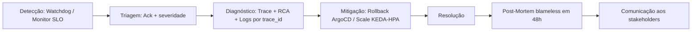

# AIOps e Gestão de Incidentes

> Relatório completo do projeto para [AIOPS e ITSM][1]

## AIOps — Datadog Watchdog

O Watchdog é nativo da plataforma Datadog: passa a operar automaticamente assim que há volume de dados de APM e infraestrutura — o que já é o caso aqui (traces via `otel-collector` → exporter Datadog, infraestrutura via `datadog-agent`). Duas funcionalidades já ativas sem configuração adicional:

- **Watchdog Insights** — detecção autônoma de anomalias de erro/latência por serviço.
- **Watchdog RCA** — sugestão automática de causa raiz quando um monitor dispara (ex: correlação com deploy recente).

Formalizado via Terraform um monitor explícito usando o mesmo algoritmo de anomalia (`anomalies()`), em `terraform/modules/observability/monitors.tf`, integrado ao mesmo canal de alerta (`@pagerduty-SolidaryTech`) dos monitores de SLO.

## Matriz de severidade

Ancorada nos SLOs já definidos (ver [SRE e Confiabilidade](./sre.md)):

| Severidade | Gatilho |
|---|---|
| **SEV1** | Burn rate do error budget > 14.4x |
| **SEV2** | Latência P99 acima do limiar do `donation-service` |
| **SEV3** | Anomalia do Watchdog sem violação de SLO confirmada |

## Fluxo de vida do incidente

- **Mitigação** se apoia na entrega GitOps: revertar o deploy é só reverter o commit, o ArgoCD (`selfHeal: true`) aplica sozinho.
- **Gaps conhecidos** (registrados, não implementados): sem circuit breaker/feature flag para isolar dependências degradadas; sem página de status para comunicação externa aos doadores.

[1]: https://github.com/rodx64/pos_arch/blob/develop/fase_5/tech_challenge/doc/5_ITSM_AIOps.md
