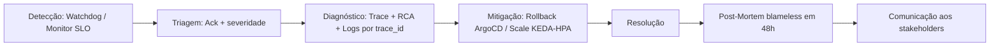

# AIOps e Gestão de Incidentes

## AIOps — Datadog Watchdog

O Watchdog é nativo da plataforma Datadog: passa a operar automaticamente assim que há volume de dados de APM e infraestrutura — o que já é o caso aqui (traces via `otel-collector` → exporter Datadog, infraestrutura via `datadog-agent`). Duas funcionalidades já ativas sem configuração adicional:

- **Watchdog Insights** — detecção autônoma de anomalias de erro/latência por serviço.
- **Watchdog RCA** — sugestão automática de causa raiz quando um monitor dispara (ex: correlação com deploy recente).

Além do Watchdog autônomo, um monitor explícito formaliza o comportamento esperado via **Terraform** (provider Datadog), no módulo [`terraform/modules/observability/monitors.tf`][tf-monitors], usando o algoritmo `anomalies()` e integrado ao mesmo canal de alerta (`@pagerduty-SolidaryTech`) dos monitores de SLO:

```hcl
# monitors.tf — monitor de anomalia de latência
query = "avg(last_5m):p99:solidary_tech.http_request_duration_seconds{...} > 0.25"
```

## Matriz de Severidade

Ancorada nos SLOs já definidos (ver [SRE e Confiabilidade](./sre.md)):

| Severidade | Gatilho | Ação imediata |
|---|---|---|
| **SEV1** | Burn rate do error budget > 14.4× | PagerDuty on-call imediato |
| **SEV2** | Latência P99 acima do limiar do `donation-service` (> 250ms) | Investigação via APM + traces |
| **SEV3** | Anomalia do Watchdog sem violação de SLO confirmada | Monitoramento reforçado, sem escalação imediata |

## Fluxo de Vida do Incidente


```mermaid
flowchart LR
    A[Detecção: Watchdog / Monitor SLO] --> B[Triagem: Ack + severidade]
    B --> C[Diagnóstico: Trace + RCA + Logs por trace_id]
    C --> D[Mitigação: Rollback ArgoCD / Scale KEDA-HPA]
    D --> E[Resolução]
    E --> F[Post-Mortem blameless em 48h]
    F --> G[Comunicação aos stakeholders]
```

### Detalhamento por etapa

**Detecção** — O monitor de burn rate ou o Watchdog dispara via Datadog → PagerDuty. O alerta já carrega o `trace_id` e o serviço afetado.

**Triagem** — O on-call faz `ack` no PagerDuty, classifica a severidade pela matriz acima e abre o incident no Datadog (ou canal de incidentes no Slack, dependendo da configuração de notificação).

**Diagnóstico** — Via Datadog APM: navegar da métrica anômala para o trace raiz (`POST /donations` ou equivalente), cruzando Go ↔ Python na árvore distribuída. Loki disponível como fallback para logs de nível mais baixo via Grafana.

**Mitigação** — Duas alavancas principais:
- **Rollback:** reverter o commit de deploy no repositório; o ArgoCD (`selfHeal: true`, `prune: true`) reconcilia automaticamente em segundos.
- **Scale manual:** se for pressão de carga, escalar o `donation-service` via KEDA ou ajustar o `maxReplicaCount` temporariamente.

**Post-Mortem** — Blameless, em até 48h após a resolução. Documenta: linha do tempo, causa raiz, impacto (% de error budget consumido), ações corretivas e prazo. Revisado pelo time antes de publicação.

## Gaps Conhecidos

- **Sem circuit breaker / feature flag:** não há mecanismo de isolar uma dependência degradada (ex: banco com latência alta) sem rollback completo de serviço.
- **Sem página de status:** doadores e ONGs não têm visibilidade proativa de incidentes em andamento.

[tf-monitors]: https://github.com/rodx64/pos_arch/blob/develop/fase_5/tech_challenge/solidary-tech/terraform/modules/observability/monitors.tf
