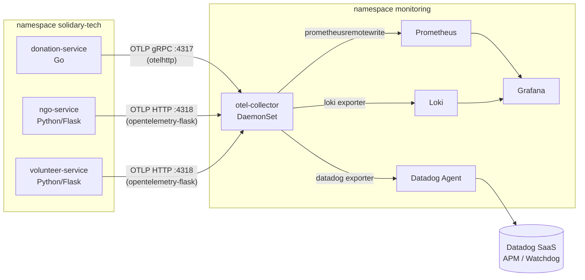

# Observabilidade e AIOps

Stack híbrida, alimentada por uma única instrumentação (OpenTelemetry) nos 3 serviços — um único ponto de coleta, dois destinos de análise.

## Arquitetura de Coleta

O `otel-collector` recebe traces/métricas/logs e `filelog`, processa com `k8sattributes` (enriquece com metadados do pod) e `transform` (normaliza `operation.name`), e exporta para os dois destinos em paralelo. O `donation-service` (Go) envia via **OTLP gRPC** (porta 4317); `ngo-service` e `volunteer-service` (Python/Flask) enviam via **OTLP HTTP** (porta 4318, path `/v1/traces`).

## Stack Open-Source (Prometheus + Loki + Grafana)

- **Prometheus** — coleta métricas via `prometheusremotewrite` do OTel Collector. Métricas base: `http_requests_total`, `http_request_duration_seconds`, `db_up`.
- **Loki** — armazena logs estruturados exportados pelo OTel Collector.
- **Grafana** — painel "Solidary Tech — Saúde do Ecossistema": CPU/memória por pod, taxa de requisições, latência P99, `donations_created_total` e status dos componentes.

## Stack APM/SaaS (Datadog)

- **Traces distribuídos** — árvore completa de chamadas Go ↔ Python em cada requisição.
- **Métricas de SRE** — dashboards de SLO e error budget (provisionados via Terraform, não manualmente).
- **Watchdog / AIOps** — detecção autônoma de anomalias comportamentais. Ver [AIOps e Gestão de Incidentes](./itsm-aiops.md).

## Métricas Customizadas

Cada serviço expõe `/metrics` (formato Prometheus):

| Métrica | Tipo | Serviços |
|---|---|---|
| `http_requests_total` | Counter | Todos |
| `http_request_duration_seconds` | Histogram | Todos |
| `db_up` | Gauge | Todos |
| `donations_created_total` | Counter | `donation-service` |

`donations_created_total` é a **golden metric de negócio**: a única métrica que representa diretamente o valor entregue à missão da ONG. Queda nessa métrica sem queda no `http_requests_total` indica problema no domínio, não na infra.

## SLOs

Definidos para a jornada crítica de doação (taxa de sucesso 99.9%, latência 95% ≤ 250ms, jornada end-to-end 99%), gerenciados via Terraform (provider Datadog). Detalhes completos em [SRE e Confiabilidade](./sre.md).

## Referências no repositório

- [Configuração OTel no cluster (EKS observability)][eks-obs]
- [Módulo Terraform de observabilidade (SLOs, monitores, dashboards)][tf-obs]

[eks-obs]: https://github.com/rodx64/pos_arch/tree/develop/fase_5/tech_challenge/solidary-tech/eks/observability
[tf-obs]: https://github.com/rodx64/pos_arch/tree/develop/fase_5/tech_challenge/solidary-tech/terraform/modules/observability
